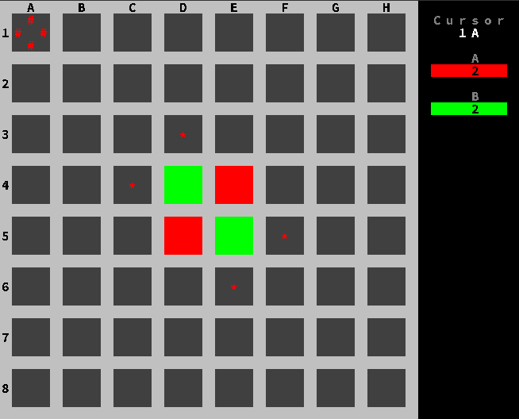
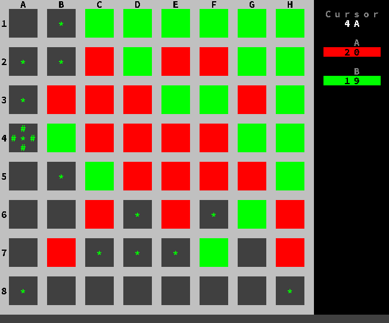
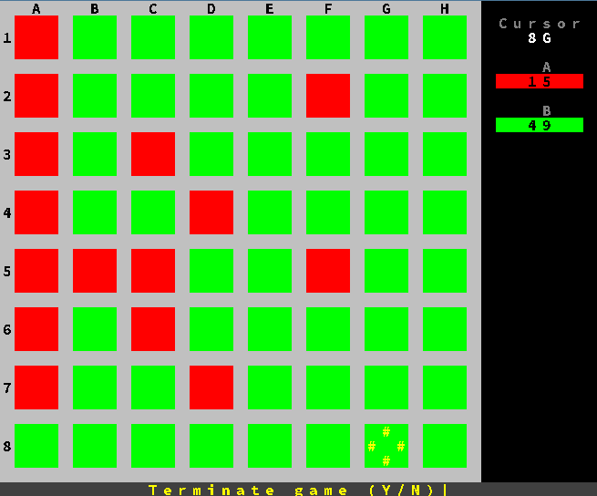

# Reversi

This is a simple implementation of the game Reversi (also known as Othello) in Java. 
It is a two-player game, where the players take turns placing their pieces on the board. 
The goal is to have the most pieces on the board at the end of the game.

## Screenshots

## Information
This was the last work (of three, being the first two mere academic exercises) for [Programming @ ISEL](https://www.isel.pt/en/leic/programming).

- [Problem set](docs/reversi.pdf) (Portuguese)
- [Report](docs/report.pdf) (Portuguese)

## How to run

### Requirements
- Java SDK 8

The following instructions must be executed in the root directory of the project (_isel-academic-archive/year_1/semester_1/Pg/Reversi_)

### Compile

#### Windows & Linux
`javac -cp libs/ConsolePG.jar -d . src/*.java`

### Execute

#### Windows
`java -cp .;libs/ConsolePG.jar Reversi`

#### Linux
`java -cp .:libs/ConsolePG.jar Reversi`

## Authors
- João Nunes ([joaonunatingscode](https://github.com/joaonunatingscode))
- Miguel Marques ([mjbmarques](https://github.com/mjbmarques))