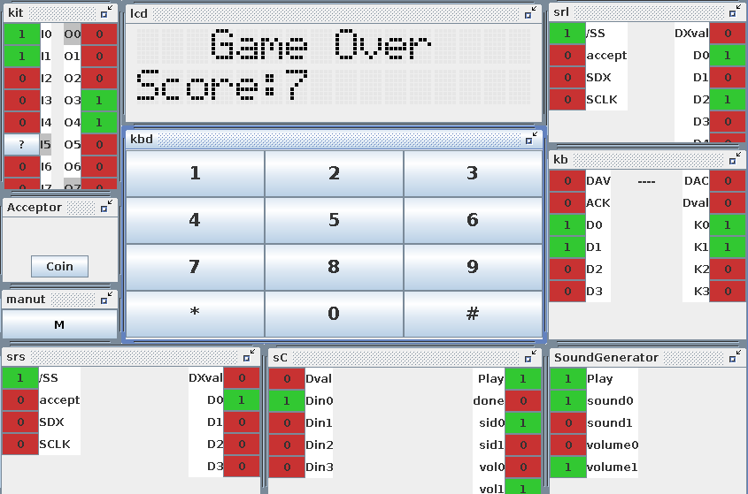

# Space Invaders

Mini-arcade system (hardware & software) of the classic arcade game [Space Invaders](https://en.wikipedia.org/wiki/Space_Invaders).
In this implementation the aliens (enemy ships) are represented by a number.
To kill an alien you have to type the number of the alien and shoot.
The aliens are moving from right to left.
The game is over when an alien reaches your ship in the left side of the screen.

## Screenshots

  
  
  

## Information

This was developed for [Informatics and Computer Laboratory @ ISEL](https://www.isel.pt/en/leic/informatics-and-computer-laboratory). This course is a full semester project with multiple delivery checkpoints and a final delivery.

- [Project description](resources/project-description.pdf) (Portuguese)
- [Project documentation](resources/docs) (Portuguese)

### Hardware

The hardware was mounted & tested in laboratory classes and in Logisim at home using the simulator.
Any Programmable Array Logic (PAL) were programmed using WinCUPL.

List of parts used:
- 3x PAL's ATF750C ([datasheet](hardware/datasheets/PAL%20ATF750C/Data%20sheet%20-%20ATF750C))
- 1x 74HCT574 ([datasheet](hardware/datasheets/Flip%20Flop%2074HCT574/74HCT574.pdf))
- 1x LCD 16x2 ([datasheet](hardware/datasheets/LCD))
- 2/3x breadboards
- 1x Kit UsbPort (bridge between software & hardware)*
- 1x ATB (connections containing switches and LED's)*

*proprietary hardware from institution

### Software

It was used IntelliJ (with Java Language Version 8) for the software part of this project.

## How to run
The following section explains how to run the project in **simulation mode**.
For more information on how to run the project using the hardware provided please contact the [authors](#authors).

### Requirements

- Java SDK 8 or IntelliJ IDEA (recommended)

### Setup
The following instructions must be executed in the [root directory of the software part of this project](./software/) (_isel-academic-archive/year_1/semester_2/LIC/software_):

`java -jar SpaceInvaders.jar` (this will compile the simulator)

### Run

#### Through CLI

##### Compile
`javac -cp SpaceInvaders.jar -d . src/edu/isel/lic/game/*.java src/edu/isel/lic/link/*.java src/edu/isel/lic/link/sound/*.java src/edu/isel/lic/peripherals/KBD.java src/edu/isel/lic/peripherals/lcd/*.java`

##### Execute
`java -cp .:SpaceInvaders.jar edu.isel.lic.game.APP`

#### Through IntelliJ IDEA
This method is much easier than the previous one. First make sure you add the Java SDK 8 and the _SpaceInvaders.jar_ library to the project:
1. File &#8594; Project Structure &#8594; Project &#8594; Project SDK &#8594; Add New SDK &#8594; Select Java SDK 8
2. File &#8594; Project Structure &#8594; Project &#8594; Project Libraries &#8594; Add New Library &#8594; Select _SpaceInvaders.jar_ file

Then you can run the project by going into _edu.isel.lic.game.APP_ class and clicking the green arrow next to the main method.

### How to play
- First, you must insert coins using the _Acceptor_ module.
- Press '*' to start the game.
- Press the number corresponding to the alien in front of you and the press '*' to shoot.
- You can enter maintenance mode by pressing 'M' in the _manut_ module. Here you can view the total games and coins the machine has played and colected, respectively. You can also shutdown the machine.

## Authors
- João Nunes ([joaonunatings](https://github.com/joaonunatings))
- Miguel Marques ([mjbmarques](https://github.com/mjbmarques))
- Alexandre Luís ([AlexoLeao](https://github.com/AlexoLeao))