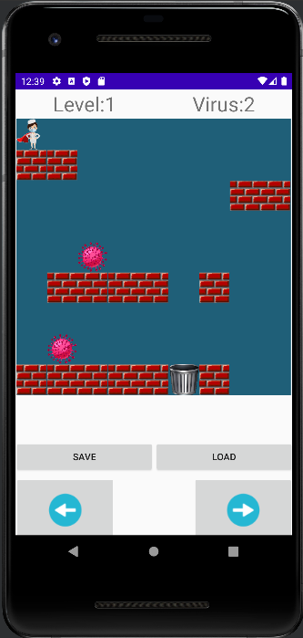
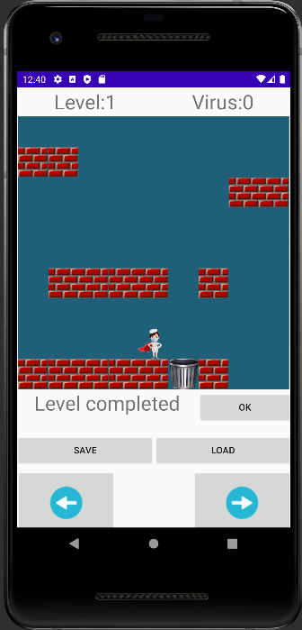
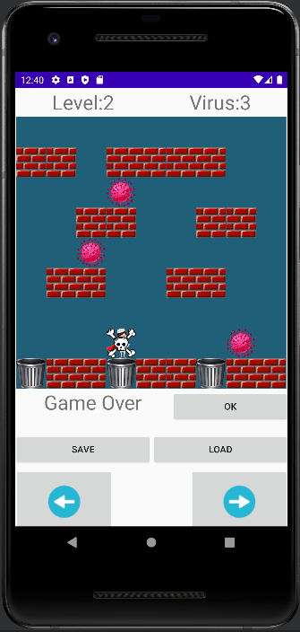

# Covid

Android platform game where a nurse pushes Covid-19 entities to the trash. If the nurse falls into the trash, it's game over.
This implementation features multiple levels, localization and landscape layout.

## Screenshots

    
    
    

## Information
Second project for Object Oriented Programming @ ISEL (now called [Software Development Techniques](https://www.isel.pt/en/leic/software-development-techniques)).
This project was developed in Android Studio.

- [Project description](docs/project-description.pdf)

## How to run

### Requirements
- Java SDK 11
- A device/emulator with Android >= 29.

In order to **build** and **deploy** the application follow [this guide](https://developer.android.com/studio/build/building-cmdline).

## Authors
- João Nunes ([joaonunatings](https://github.com/joaonunatings))
- Miguel Marques ([mjbmarques](https://github.com/mjbmarques))
- Bruno Baptista ([BrunoAT](https://github.com/BrunoAT))