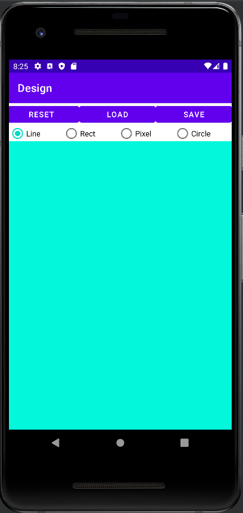
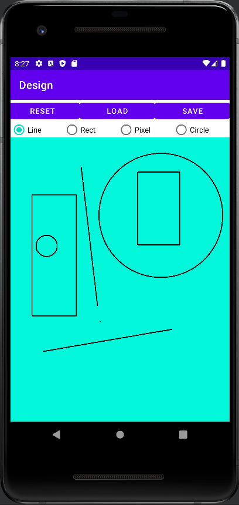

# Design

Android application used to draw in the screen.
This implementation supports drawing of lines, rectangles, pixels and circles.
It also allows the user to save, load and reset the state of the drawing.

## Screenshots

  
  

 

## Information
First project for Object Oriented Programming @ ISEL (now called [Software Development Techniques](https://www.isel.pt/en/leic/software-development-techniques)).
This project was developed in IntelliJ IDEA.

- [Project description](docs/project-description.pdf) (Portuguese)

## How to run

### Requirements
- Java SDK 11
- A device/emulator with Android API >= 29.

In order to **build** and **deploy** the application follow [this guide](https://developer.android.com/studio/build/building-cmdline).

## Authors
- João Nunes ([joaonunatingscode](https://github.com/joaonunatingscode))
- Miguel Marques ([mjbmarques](https://github.com/mjbmarques))
- Bruno Baptista ([BrunoAT](https://github.com/BrunoAT))