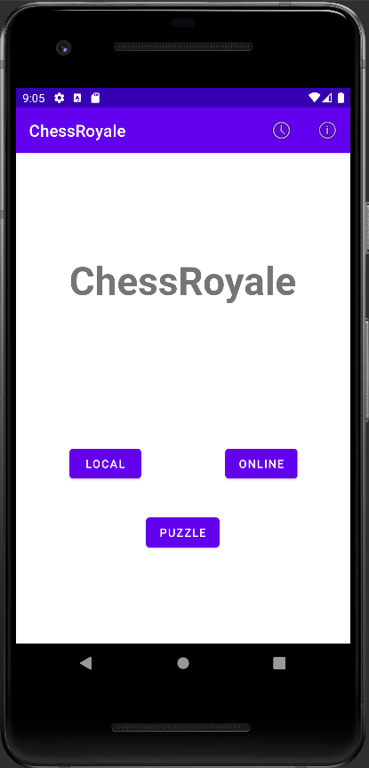
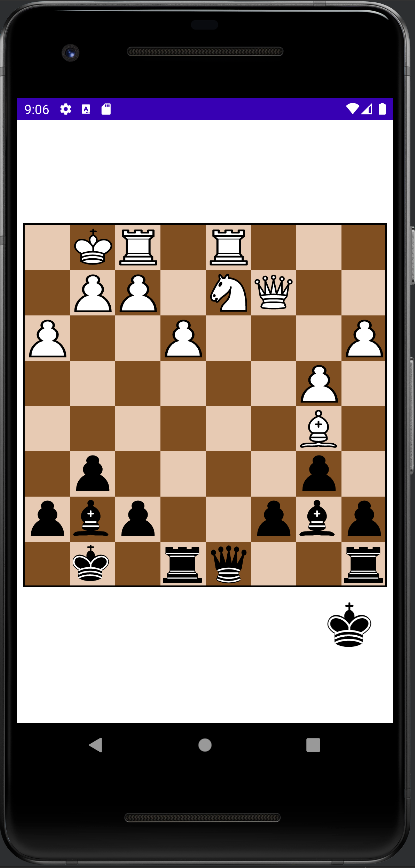

# ChessRoyale

Android chess game. 
This implementation features singleplayer, daily puzzle (from [Lichess](https://lichess.org/)) and multiplayer.

## Screenshots

    
    

## Information

Project for [Mobile Devices Programming @ ISEL](https://www.isel.pt/en/leic/mobile-devices-programming).

This project was developed in 3 phases.
- [Project description (part 1)](docs/project-description1.pdf)
- [Project description (part 2)](docs/project-description2.pdf)
- [Project description (part 3)](docs/project-description3.pdf)

## How to run

### Requirements
- Cloud Firestore Database ([tutorial](https://firebase.google.com/docs/firestore/quickstart))
- A device/emulator with Android >= 26.

After setting up the Firestore Database you can **build** and **deploy** the application following [this guide](https://developer.android.com/studio/build/building-cmdline).

## Authors
- João Nunes ([joaonunatings](https://github.com/joaonunatings))
- Alexandre Silva ([Cors00](https://github.com/Cors00))
- Miguel Marques ([mjbmarques](https://github.com/mjbmarques))