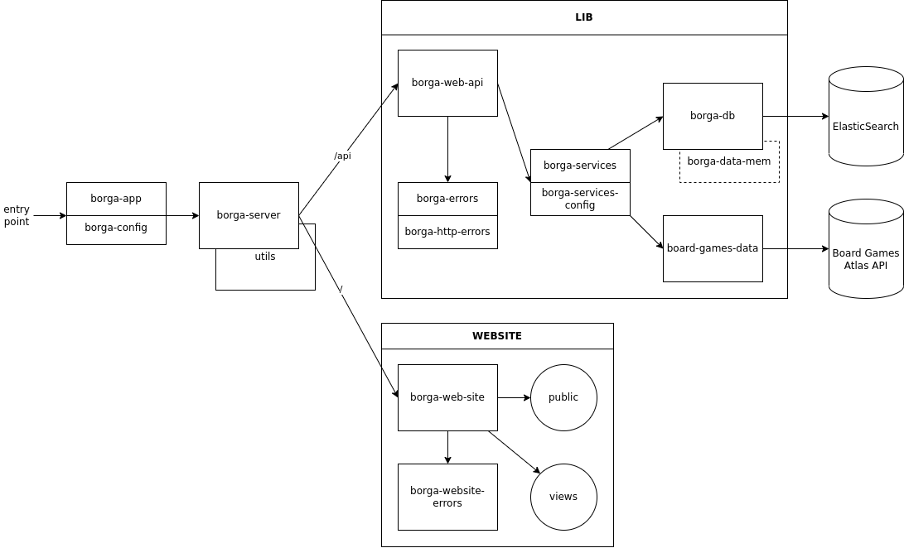

# BORGA 

## Overview
The **BO**a**R**d **G**ames **A**pplication is a web application that allows users to search for a variety of board games and add them to customizable groups.

The user can search for games, view its details and add it to a group. Groups contain a title, description and list of games. Each user can create and log in an account in the web application.

This application is splitted into **two** key components: [server](#server) and [client](#client). Both were developed using [NodeJS](https://nodejs.org/en/about/). The server side uses [ElasticSearch](https://www.elastic.co/what-is/elasticsearch) (for the local database) and [BGA API](https://www.boardgameatlas.com/api/docs) (for the board games database). The client side uses [HandleBars](https://handlebarsjs.com/guide/) for HTML templating and [Passport](https://www.passportjs.org/) for user authentication.

## Table of contents
- [Functionalities](#functionalities)
- [Description](#description)
	- [Structure](#structure)
	- [Server](#server)
	- [Client](#client)
	- [Data Storage Design](#data-storage-design)
- [Requirements](#requirements)
	- [NodeJS](#nodejs)
	- [Board Game Atlas API](#board-game-atlas-api)
	- [ElasticSearch](#elasticsearch)
	- [Browser](#browser)
- [Run the application](#run-the-application)
- [Developing the application](#developing-the-application)
- [Documentation](#documentation)
- [Credits](#credits)

## Functionalities
- Search games by rank, name and price
- Manage favorite game groups
	- Create and delete groups (name and description)
	- Edit a group name or description
	- Add/remove a game to/from a group
	- See group details
- User authentication

## Description

Any URL referenced is using the local IP address of host machine (i.e.: http://localhost:8080 or http://127.0.0.1:8080). At the [deploy phase](#deploying-application) the URL becomes public.
### Structure

### Server
The server side of this application contains the following modules:
- *borga-web-api*: contains setup of the API routes 
- *borga-services*: contains all services provided by the API
- *borga-db*: access module to *ElasticSearch* database
- *board-games-data*: access module to *Board Game Atlas API* database

The *borga-web-api* and *borga-services* each contain a specific implementation, either a router or a service (i.e.: *games.route* and *games.service*).

### Client
Client-side scripts are programs processed within the client browser, allowing dynamics interactions on the page, often to validate input, manipulating UI elements, and-so-on. All the functions are implemented on Node JS, hiding them from the front end user. 
Able to listen to events, such as, button clicks to perform side effects on server-side zone this allows to, for example, update a group name and/or description using PUT (following REST guidelines) and DELETE, methods not allowed on [HTML Standards](https://html.spec.whatwg.org/multipage/forms.html#element-attrdef-form-method).

### Data Storage Design
In order to keep solid information about the users and their game groups, a storage design in *ElasticSearch* is created.
The design used in this application is as follows:

#### Users
Index location: *users*.
Each user is represented by a document that keeps the following information:
- *username*: User defined name
- *password*: User defined password
- *token*: Token in the [UUID format](https://pt.wikipedia.org/wiki/Identificador_%C3%BAnico_universal), used in authentication users and keeping session information

Whenever a user is created, a UUID token must be generated. For this, *[crypto](https://developer.mozilla.org/en-US/docs/Web/API/Crypto).randomUUID()* is used.

#### Groups
Index location: *\<username\>_groups*, where \<username\> is the user defined name (it must exist in the database!).
Each group is represented by a document that keeps the following information:
- *name*: Name of group
- *description*: Description of group
- *games*: List of game ids

- Groups: located at *\<username\>_groups* where \<username\> must be an existing user *username* in the database (i.e.: *username*=guest, *index name*=guest_groups)

More *ElasticSearch* documentation [here](https://www.elastic.co/guide/en/elasticsearch/reference/current/rest-apis.html).

## Requirements

Before running the application, the following steps are necessary:

### NodeJS
This application uses the [Javascript](https://en.wikipedia.org/wiki/JavaScript) runtime: NodeJS. 
This is needed to run any *application scripts* and use the [required *node packages*](#install-package-dependencies).

Install NodeJS [here](https://nodejs.org/en/download/). You can also install it using a *package manager* [here](https://nodejs.org/en/download/package-manager/).

### Board Game Atlas API
The server uses the *Board Game Atlas API* in order to access a variety of board games information. To use this API register an account [here](https://www.boardgameatlas.com/api/docs) and then follow their instructions in order to register an app [here](https://www.boardgameatlas.com/api/docs/apps)

After registering the application copy the generated *client_id* for later use.

### ElasticSearch
The server uses *ElasticSearch* to store user and group information.

Install ElasticSearch [here](https://www.elastic.co/downloads/elasticsearch).

**Note:** Make sure this service is always running on your OS when running the application

### Browser
A browser is needed in order to view the server API documentation and the web application.
Make sure you have one which supports [ECMAScript 6](http://es6-features.org/#Constants).

## Run the application

This step takes into account that [requirements](#requirements) are already met.

First clone this repository into your local machine:

`git clone https://github.com/isel-leic-ipw/borga-ipw_pi-leicpi51d-g01.git`

### Install package dependencies
All required packages are listed below:
- [node-fetch](https://www.npmjs.com/package/node-fetch): used for all types of HTTP Requests
- [express](https://www.npmjs.com/package/express): web framework for the application
- [swagger-ui-express](https://www.npmjs.com/package/swagger-ui-express) and [yamljs](https://www.npmjs.com/package/yamljs): for interactive API documentation
- [bootstrap-icons](https://icons.getbootstrap.com/): used by the website for high quality svg icons
- [bhs](https://www.npmjs.com/package/hbs): used in the website for HTML templating
- [passport](https://www.npmjs.com/package/passport) and [session](https://www.npmjs.com/package/express-session): user and authentication and session state, respectively

In order to install these packages, go into the repository folder and run:

`npm install`

### Run the application

Run the application by running:

`npm start <client_id> <server_host> <server_port>`

Where *client_id* is the id generated while registering this app (see [here](#board-game-atlas-api)).
The *server_host* and *server_port* parameters set the adress specification of the server API.
Default values are located in *borga-config.js*.

To view the web application, access in your *browser* the following address: *http://localhost:8888*.

### Deploying application
To deploy the application and make it visible to everyone on the Internet, use [Heroku](https://www.heroku.com/).

## Documentation
The server API uses the [OpenAPI Specification](https://swagger.io/specification/). This way, a accurate, interactive and ready to test documentation is created. This documentation is hosted in a separate page when the server starts, using the following address: *http://localhost:8888/api/docs*.

## Credits
Developed by:
- [joaonunatings](https://github.com/joaonunatings)
- [mjbmarques](https://github.com/mjbmarques)
- [Cors00](https://github.com/Cors00)