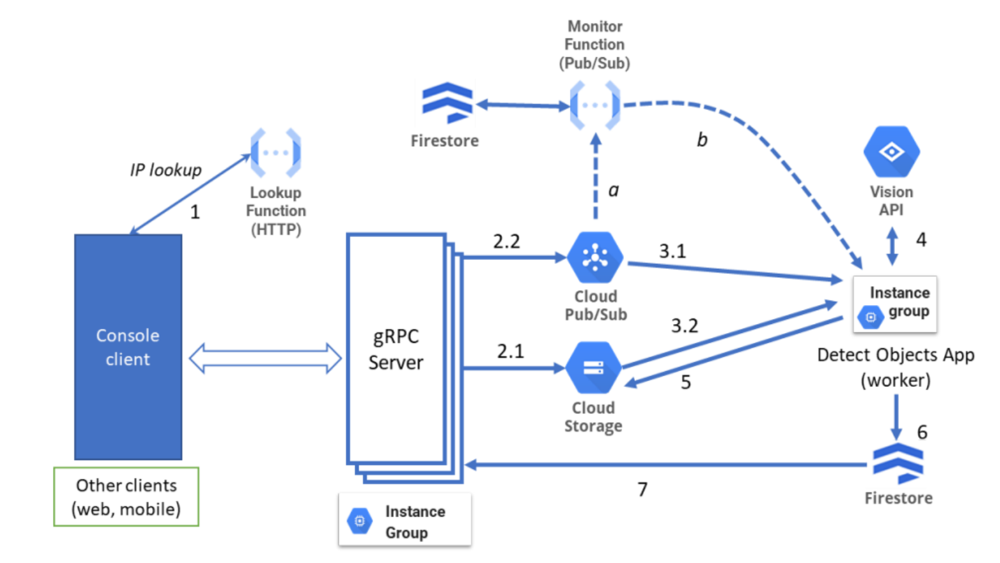

# CN2122TF

Distributed system which detects multiple objects in images. Each image will have a resulting image with each object classified from 0 to 1. This scale represents the certainity.

## Screenshots

    

## Information

Project for [Cloud Computing @ ISEL](https://www.isel.pt/en/leic/cloud-computing).

## How to run

Please contact the [authors](#authors) on how to run this system.

## Authors
- João Nunes ([joaonunatings](https://github.com/joaonunatings))
- Alexandre Luís ([AlexoLeao](https://github.com/AlexoLeao))
- Paulo Rosa ([p4ulor](https://github.com/p4ulor))